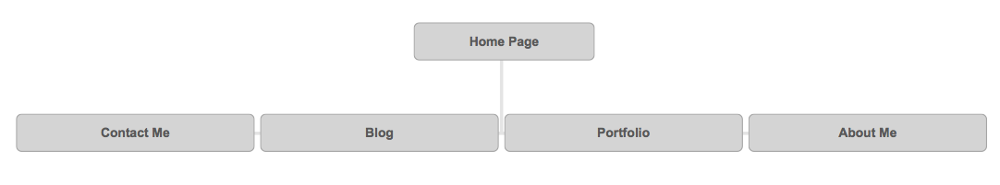

<a href="imgs/site-map.png">Site-Map</a>

What are the 6 Phases of Web Design?
- The six phases of Web Design are: Information Gathering, Planing, Design, Development, Testing and delivery, and Maintenance.

What is your site's primary goal or purpose? What kind of content will your site feature?
- My site's primary goal will change as time goes on. Right now the primary goal of my sight is to solidify good practices of HTML and CSS. As I become a better designer, I will focus on implementing different sections to veer towards employment.

What is your target audience's interests and how do you see your site addressing them?
- Right now my target interests are my peers, as well as my teachers. As I become a better developer, I will target employers, I like to keep things simple and straight-forward. I see my site being a simple yet effective design. I will have a home page with 4 links leading to my About Me, Portfolio, Blog, Resumé.

What is the primary "action" the user should take when coming to your site? Do you want them to search for information, contact you, or see your portfolio? It's ok to have several actions at once, or different actions for different kinds of visitors.
  - I think the right answer to this question can change over time. Right now I am looking towards displaying information. Once i become a better developer, I will aim towards showing my portfolio/ contacting me.

What are the main things someone should know about design and user experience?
 - I think the number one thing people should realize, is that there is a lot more than meets the eye towards putting together a web page. It is driven by the user interaction/experience. I just want to add that although it may seem straight forward, the user experience is all about how the user feels while using the page. I know from my own experience that when I reach a page that has bag design, it can be challenging to navigate / frustrating.

What is user experience design and why is it valuable?
  - User experience design is geared toward what the user will enjoy interacting with instead of what the client wants to see. This process has changed over time as the old process was something like - Does the Client like this? No? They do not like it, so we will revise. The Client likes this? yes, so we are done. In the modern age, we have access to web pages where ever we may go. We are now designing geared towards accesibility making web pages accessible on mobile devices.

Which parts of the challenge did you find tedious?
  - I did not find anythign very tedious. I was annoyed that I could not figure out the relative pathing on my own. But it is all a learning experience which is exciting, not tedious.