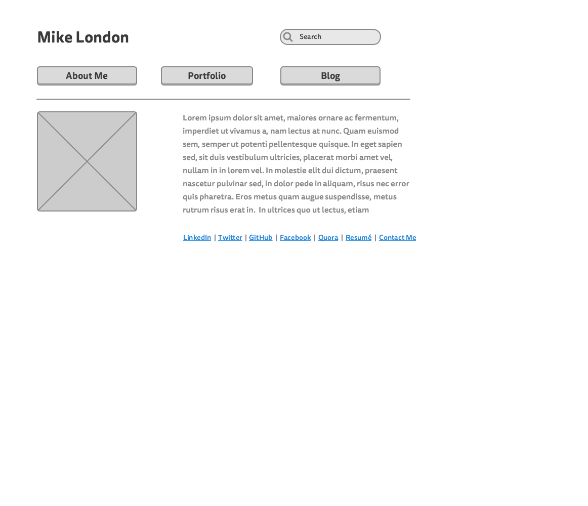

<a href"imgs/index-framework.png">Index Wireframe </a>

<a href"imgs/Wireframe-blog-index.png"> Blog Wireframe</a>

What is a wireframe?
-Wireframing is the designing of the screen for what the User will see and interact with. This is similar to pseudo-coding, where the user is planning out their way of attack. This is a necessary in designing the project/website.

What are the benefits of wireframing?home screen
-A benefit to wireframe is that is gives you the designer the ability to see what you are working with. It will lead to styling the site in a certain way. I think that it will definitely save time when actually writing the code to the website.

Did you enjoy wireframing your site?
-Yes,  I felt like I was interacting with the naked site with nothing on it. I could design it how I want. I have never felt something like that from just coding some ruby program.  It was a cool feeling. Even though it wasn't like I was coding this website, I was still outlining what I think would look nice.

Did you revise your wireframe or stick with your first idea?
- Yes, I originally did not put my social media links located at the bottom of the home-screen. Before I swapped the location, I had them inside my about me. I also added in the location index at the bottom of the screen.

What questions did you ask during this challenge? What resources did you find to help you answer them?
- At first I asked myself what the heck was wireframing. I had never heard of the term, but once I started reading the Beginners Guide to Wireframing I figured out it was like white boarding an idea out, in this case a website.  I looked at wireframing on wikipedia and came across the different terms thrown around like visual diagram, blueprint , etc.

Which parts of the challenge did you enjoy and which parts did you find tedious?
-I used the website slickplan to plan out my wireframe. I enjoyed how easy the side bars were to put together. Overall this experience was very cool. And it was very straight-forward so even better!